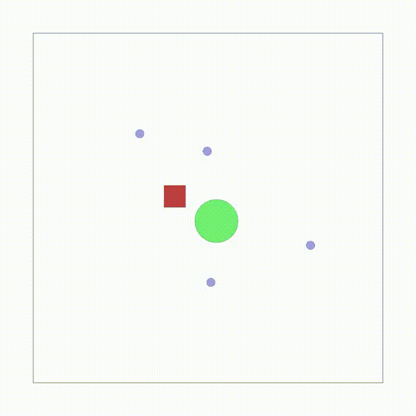
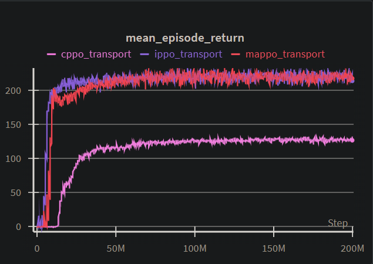

# VMAS-MARL-Transport

[](https://github.com/CJL196/VMAS-MARL-Transport)

> 2025 SYSU 强化学习课程大作业 —— 基于 VMAS 仿真器的多智能体协作任务复现



## 项目简介

本项目是强化学习课程作业 B，主要完成以下三项任务：

1. **源码阅读**：阅读论文《VMAS: A Vectorized Multi-Agent Simulator for Collective Robot Learning》并为 VMAS 核心源码添加详细的中文注释
2. **算法复现**：在 Transport 任务场景下，实现 CPPO、MAPPO、IPPO 三种多智能体强化学习算法，复现论文中的实验结果
3. **扩展研究**：分析智能体数量对实验结果的影响

## 实验结果

下图展示了三种算法在 Transport 任务上的训练曲线对比：



## 项目结构

```
.
├── marl/                   # 🔧 我的 MARL 算法实现
│   ├── train.py            # 训练主程序
│   ├── ppo.py              # PPO 算法核心实现 (CPPO/MAPPO/IPPO)
│   ├── model.py            # 神经网络模型定义
│   └── plot_results.py     # 结果可视化脚本
├── vmas/                   # VMAS 仿真器源码
│   ├── simulator/
│   │   ├── core.py         # ⭐ 核心仿真逻辑 (已添加中文注释)
│   │   └── physics.py      # 物理引擎实现
│   └── scenarios/
│       └── transport.py    # ⭐ Transport 任务场景 (已添加详细中文注释)
├── report.md               # 📝 实验报告
└── assets/                 # 实验资源
    ├── mappo_transport_success_0.gif/mp4  # 演示视频
    └── mean_episode_return.png            # 训练曲线图
```

## 源码注释说明

本项目对 VMAS 核心源代码添加了详细的中文注释，便于理解仿真器的工作原理：

| 文件 | 内容 | 注释说明 |
|------|------|----------|
| `vmas/scenarios/transport.py` | Transport 场景实现 | 完整注释，包括 `make_world`、`reset_world_at`、`reward`、`observation`、`done` 方法的详细原理说明 |
| `vmas/simulator/core.py` | 物理仿真核心 | 关键类和函数注释，包括 `TorchVectorizedObject`、`Entity`、`Agent`、`World.step()`、`_integrate_state()` 等 |

## 快速开始

### 环境配置

```bash
# 创建并激活 conda 环境
conda create -n vmas python=3.10
conda activate vmas

# 安装 PyTorch (根据你的 CUDA 版本选择合适的命令)
pip install torch torchvision

# 安装 VMAS 仿真器
pip install -e .

# 安装其他依赖
pip install wandb  # 用于训练日志记录
```

### 训练模型

在项目根目录下运行训练：

```bash
# IPPO 算法
python -m marl.train --algo ippo --scenario transport --no_video

# MAPPO 算法
python -m marl.train --algo mappo --scenario transport --no_video

# CPPO 算法
python -m marl.train --algo cppo --scenario transport --no_video
```

### 命令行参数说明

| 参数 | 默认值 | 说明 |
|------|--------|------|
| `--scenario` | `transport` | VMAS 场景名称 (本项目使用 Transport) |
| `--algo` | `ippo` | 算法选择：`ippo` / `mappo` / `cppo` |
| `--num_envs` | `1024` | 并行环境数量，利用 VMAS 的向量化加速 |
| `--max_steps` | `500000` | 总训练步数 |
| `--steps_per_update` | `100` | 每次 PPO 更新收集的步数 |
| `--lr` | `5e-5` | 学习率 |
| `--ppo_epochs` | `10` | 每次更新的 PPO 迭代轮数 |
| `--num_minibatches` | `8` | 每轮的 minibatch 数量 |
| `--seed` | `42` | 随机种子 |
| `--max_episode_steps` | `500` | 单回合最大步数 (超时截断) |
| `--use_curriculum` | `True` | 启用课程学习 (逐步增加包裹质量) |
| `--curriculum_steps` | `100` | 课程学习的更新次数 |
| `--no_video` | `False` | 禁用视频录制以提升训练速度 |

### 查看训练结果

训练过程中的日志和曲线会自动记录到 [WandB](https://wandb.ai)，首次运行需要登录：

```bash
wandb login
```

## 实验报告

完整的实验报告请参阅 [report.md](report.md)，包含：

- VMAS 仿真器架构分析与源码解读
- CPPO/MAPPO/IPPO 算法原理与实现细节
- Transport 任务实验结果分析
- 智能体数量对性能的影响讨论

## 参考资料

- 论文：[VMAS: A Vectorized Multi-Agent Simulator for Collective Robot Learning](https://arxiv.org/abs/2207.03530)
- VMAS官方仓库：[proroklab/VectorizedMultiAgentSimulator](https://github.com/proroklab/VectorizedMultiAgentSimulator) (本项目基于VMAS官方仓库修改)
