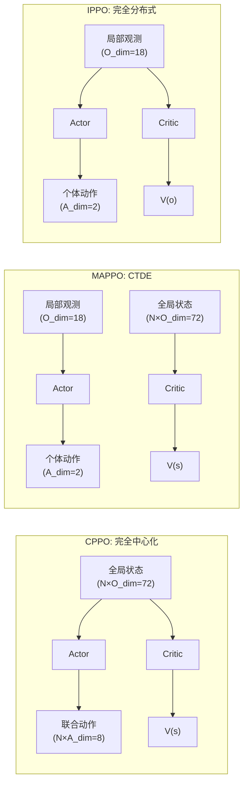
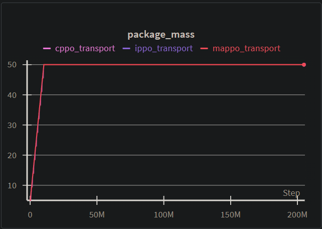
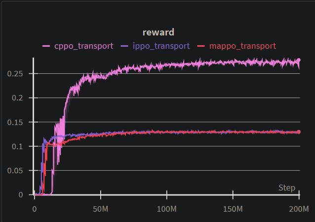

# 基于VMAS的多智能体强化学习实验报告

## 实验要求

本实验基于论文《VMAS: A Vectorized Multi-Agent Simulator for Collective Robot Learning》，选取论文中提到的 Transport 任务场景，实现并对比 CPPO、MAPPO、IPPO 三种基于 PPO 的多智能体强化学习算法，尝试复现论文中的实验结果。Transport 场景要求多个智能体协作推动一个重物到达目标位置，由于物体质量较大，单个智能体无法独自完成任务，必须多智能体协同配合。

## 算法原理

### PPO算法

PPO（Proximal Policy Optimization）是一种策略梯度强化学习算法，旨在实现 TRPO 的稳定性和可靠性，同时避免其复杂的二阶优化过程。PPO 的核心思想是通过裁剪后的目标函数来限制策略更新的幅度，在保证训练稳定的前提下简化实现。

首先定义新旧策略的概率比率 $r_t(\theta) = \frac{\pi_\theta(a_t | s_t)}{\pi_{\theta_{\text{old}}}(a_t | s_t)}$。当 $r_t(\theta) > 1$ 时，表示动作 $a_t$ 在新策略下出现的概率增大；当 $0 < r_t(\theta) < 1$ 时，表示该动作的概率减小。PPO-Clip 通过对这个比率进行裁剪来限制策略更新的幅度：

$L^{\text{CLIP}}(\theta) = \mathbb{E}_t \left[ \min \left( r_t(\theta) A_t, \; \text{clip}(r_t(\theta), 1 - \epsilon, 1 + \epsilon) A_t \right) \right]$

其中 $\epsilon$ 通常取 0.1 或 0.2，这个裁剪操作的核心思想是：当优势函数 $A_t > 0$ 时，我们希望增加动作的概率，但 clip 限制了增加的上限；当 $A_t < 0$ 时，我们希望减少动作的概率，但 clip 限制了减少的下限。这样就避免了单次更新中策略变化过大的问题。

PPO 还使用广义优势估计（GAE）来平衡优势估计的偏差和方差。定义时序差分误差 $\delta_t = r_t + \gamma V(s_{t+1}) - V(s_t)$，GAE 将不同步数的优势估计进行指数加权平均：$A_t^{GAE} = \sum_{l=0}^{\infty} (\gamma \lambda)^l \delta_{t+l}$。参数 $\lambda \in [0, 1]$ 控制了偏差-方差的权衡：当 $\lambda = 0$ 时仅看一步差分，偏差低但方差高；当 $\lambda = 1$ 时看所有步的差分，偏差高但方差低。

### VMAS 物理仿真引擎深度解析

VMAS（Vectorized Multi-Agent Simulator）是一个基于 PyTorch 构建的向量化多智能体仿真器，其核心优势在于能够利用 GPU 并行计算同时模拟数千个环境实例。理解 VMAS 的物理引擎对于分析实验结果至关重要。

#### 向量化并行计算

VMAS 的核心设计理念是"批处理优先"（Batch-first）。所有物理状态（位置、速度、力）都以张量形式存储，第一维是并行环境数量 `batch_dim`。例如，在本实验中使用 1024 个并行环境时，每个智能体的位置张量形状为 `(1024, 2)`，表示 1024 个环境中该智能体的二维坐标。这种设计使得单次 PyTorch 张量运算即可更新所有环境的状态，相比传统的 for 循环逐环境模拟，速度提升可达 100 倍以上。

#### 半隐式欧拉积分

VMAS 使用**半隐式欧拉方法（Semi-implicit Euler）**进行物理状态积分，这是游戏物理引擎中常用的数值积分方法。其核心公式如下：

$$
\begin{aligned}
\mathbf{v}_{t+1} &= (1 - \zeta) \cdot \mathbf{v}_t + \frac{\mathbf{F}_t}{m} \cdot \Delta t \quad \text{(先更新速度)} \\
\mathbf{x}_{t+1} &= \mathbf{x}_t + \mathbf{v}_{t+1} \cdot \Delta t \quad \text{(再用新速度更新位置)}
\end{aligned}
$$

其中 $\zeta$ 是阻尼系数（drag），$\mathbf{F}_t$ 是合力，$m$ 是质量，$\Delta t$ 是时间步长。与显式欧拉方法（先更新位置再更新速度）相比，半隐式欧拉具有更好的**能量守恒性**，不会出现系统能量随时间发散的问题，这对于长时间运行的强化学习训练尤为重要。

#### 力的计算与碰撞响应

在每个仿真步中，VMAS 按以下顺序计算作用力：

1. **动作力 $\mathbf{F}^a$**：由智能体策略网络输出的控制力
2. **重力 $\mathbf{F}^g$**：可选的全局重力场（Transport 场景中为零）
3. **摩擦力 $\mathbf{F}^f$**：与速度方向相反的阻力
4. **碰撞力 $\mathbf{F}^c$**：基于穿透深度的惩罚力，公式为 $\mathbf{F}^c = k \cdot \max(0, d_{min} - d) \cdot \hat{\mathbf{n}}$

其中 $k$ 是碰撞刚度系数，$d$ 是两物体间距，$d_{min}$ 是最小允许距离，$\hat{\mathbf{n}}$ 是碰撞法向量。这种基于惩罚力的碰撞模型计算简单且易于向量化，适合大规模并行仿真。

### CPPO、MAPPO、IPPO

这三种算法都基于 PPO，核心区别在于 Actor（策略网络）和 Critic（价值网络）的输入和结构设计。根据中心化程度的不同，它们形成了一个算法谱系。

CPPO（Centralized PPO）将多智能体问题完全简化为单智能体问题。它使用一个"超级智能体"同时控制所有个体，Actor 和 Critic 都接收全局状态作为输入。具体而言，Actor 输入是所有智能体观测的拼接（维度为 $n \times obs\_dim$），输出是所有智能体的联合动作（维度为 $n \times act\_dim$）；Critic 同样接收全局状态并输出单一的状态价值。这种设计的优点是能够充分利用全局信息进行决策，但问题在于联合状态空间和动作空间随智能体数量指数增长，在高方差的初始探索阶段很难泛化到未见过的状态组合。

MAPPO（Multi-Agent PPO）采用中心化训练、分布式执行的范式。每个智能体拥有独立的 Actor 网络，仅根据自己的局部观测输出动作，这保证了执行时的可扩展性。但在训练时，所有智能体共享一个集中式的 Critic，该 Critic 接收全局状态信息来估计价值函数。这种设计使得智能体在训练时能够利用全局信息学习更好的价值估计，从而产生更稳定的梯度，但执行时仍保持分布式特性。智能体之间通常采用参数共享策略，使得它们能从彼此的经验中学习。

IPPO（Independent PPO）是最简单的分布式方法。每个智能体完全独立地使用 PPO 进行学习，Actor 和 Critic 都只接收局部观测作为输入。尽管智能体之间没有显式的协调机制，但通过参数共享（所有智能体使用相同的网络权重），它们仍然能够从集体经验中受益。IPPO 的优点是实现简单、可扩展性好，并且对于需要高度初始探索的任务（如 Transport），分布式策略反而比中心化策略更容易学到有效行为。

#### 算法架构对比

下图展示了三种算法的数据流架构。以 $N=4$ 个智能体、观测维度 $O_{dim}=18$、动作维度 $A_{dim}=2$ 为例：



#### 复杂度分析

下表对比了三种算法在不同维度上的复杂度，其中 $N$ 为智能体数量，$O$ 为单智能体观测维度，$A$ 为单智能体动作维度，$H$ 为隐藏层维度：

| 特性 | CPPO | MAPPO | IPPO |
|------|------|-------|------|
| **Actor 输入维度** | $N \times O$ | $O$ | $O$ |
| **Actor 输出维度** | $N \times A$ | $A$ | $A$ |
| **Critic 输入维度** | $N \times O$ | $N \times O$ | $O$ |
| **Actor 参数量** | $O(N^2 \cdot O \cdot H)$ | $O(O \cdot H)$ | $O(O \cdot H)$ |
| **Critic 参数量** | $O(N \cdot O \cdot H)$ | $O(N \cdot O \cdot H)$ | $O(O \cdot H)$ |
| **执行时通信需求** | 需要全局状态 | 无需通信 | 无需通信 |
| **训练时通信需求** | 需要全局状态 | 需要全局状态 | 无需通信 |
| **可扩展性** | 差（维度爆炸） | 中等 | 好 |

从表中可以看出，CPPO 的 Actor 参数量随智能体数量平方增长，这是其在大规模场景中失效的根本原因。MAPPO 通过将 Actor 分布式化解决了动作空间爆炸问题，但 Critic 仍需处理全局状态。IPPO 完全避免了维度爆炸，但代价是 Critic 无法利用其他智能体的信息进行更准确的价值估计。

## 关键代码

本实验的代码结构分为三个核心部分：网络架构定义（`marl/model.py`）、PPO 算法实现（`marl/ppo.py`）和训练流程控制（`marl/train.py`）。

网络架构采用了多层感知机作为基础模块。MLP 类使用 Tanh 激活函数而非常见的 ReLU，这是因为 Tanh 输出范围在 $[-1, 1]$ 之间，与连续动作空间的归一化范围天然匹配。每层之后都添加了 LayerNorm 进行归一化，这对于强化学习中输入分布不断变化的情况尤为有效，能够稳定训练过程。网络权重采用正交初始化（Orthogonal Initialization），偏置初始化为零，正交初始化能够保持信号在前向传播过程中的方差稳定，这对于深层网络的梯度流动非常重要。Actor 网络输出动作分布的均值和标准差，动作均值输出层使用较小的正交初始化增益（0.01），这使得初始策略接近均匀分布，有利于早期探索。标准差采用可学习的对数参数 `log_std`，而非依赖于状态的输出，这种状态无关的标准差设计简化了网络结构，同时通过可学习参数仍然保留了策略调整探索程度的能力。对数标准差被限制在 $[-20, 2]$ 范围内，防止数值下溢或上溢导致的训练不稳定：

```python
class Actor(nn.Module):
    def __init__(self, input_dim, action_dim, hidden_dim=128):
        super(Actor, self).__init__()
        self.net = MLP(input_dim, hidden_dim, hidden_dim) 
        self.mean_layer = nn.Linear(hidden_dim, action_dim)
        self.log_std = nn.Parameter(torch.zeros(action_dim))  # 可学习的对数标准差
        nn.init.orthogonal_(self.mean_layer.weight, 0.01)     # 小增益正交初始化

    def forward(self, x):
        features = self.net(x)
        mean = self.mean_layer(features)
        log_std = torch.clamp(self.log_std, -20, 2)           # 数值稳定性限制
        std = torch.exp(log_std)
        return mean, std
```

PPO 算法的核心实现采用了 mini-batch 多轮迭代更新策略。每次更新时，首先对所有采集的优势值进行标准化，使其均值为零、方差为一，这有助于稳定策略梯度的尺度。然后将数据划分为多个 mini-batch（默认 8 个），在每个 epoch（默认 10 轮）中遍历所有 mini-batch 进行更新，这种设计使得每条经验数据被使用多次，显著提高了样本效率。概率比率 $r_t(\theta)$ 通过新旧对数概率的指数差计算，即 $r_t = \exp(\log \pi_{new} - \log \pi_{old})$，这在数值上比直接计算概率比值更稳定。策略损失使用裁剪后的替代目标函数，并加入熵正则项鼓励探索，Actor 和 Critic 使用独立的优化器更新，梯度范数被裁剪到 0.5 以防止梯度爆炸：

```python
for epoch in range(self.ppo_epochs):
    indices = torch.randperm(batch_size)
    for start in range(0, batch_size, minibatch_size):
        mb_indices = indices[start:start + minibatch_size]
        # 计算新策略下的对数概率
        mean, std = self.actor(mb_obs[mb_indices])
        dist = torch.distributions.Normal(mean, std)
        new_log_probs = dist.log_prob(mb_actions[mb_indices]).sum(dim=-1)
        # PPO-Clip 核心：裁剪概率比率
        ratio = torch.exp(new_log_probs - mb_old_log_probs[mb_indices])
        surr1 = ratio * mb_advantages[mb_indices]
        surr2 = torch.clamp(ratio, 1.0 - self.clip_param, 1.0 + self.clip_param) * mb_advantages[mb_indices]
        actor_loss = -torch.min(surr1, surr2).mean() - self.entropy_coef * dist.entropy().mean()
```

广义优势估计（GAE）的计算采用逆序递推方式。从轨迹末端开始，逐步向前计算 TD 误差 $\delta_t = r_t + \gamma V(s_{t+1})(1 - done_t) - V(s_t)$，并通过 $GAE_t = \delta_t + \gamma \lambda (1 - done_t) GAE_{t+1}$ 递推得到优势估计。这里的 $(1 - done_t)$ 项确保在 episode 结束时正确截断未来回报的传播，回报值通过 $R_t = A_t + V(s_t)$ 计算，用于更新 Critic 网络：

```python
def compute_gae(rewards, values, next_value, dones, gamma=0.99, gae_lambda=0.95):
    advantages = torch.zeros_like(rewards)
    last_gae_lam = 0
    for t in reversed(range(len(rewards))):
        next_non_terminal = 1.0 - dones[t]
        next_val = next_value if t == len(rewards) - 1 else values[t + 1]
        delta = rewards[t] + gamma * next_val * next_non_terminal - values[t]
        last_gae_lam = delta + gamma * gae_lambda * next_non_terminal * last_gae_lam
        advantages[t] = last_gae_lam
    returns = advantages + values
    return advantages, returns
```

训练流程根据算法类型区分处理数据形状和计算逻辑。对于 CPPO，全局状态由所有智能体观测拼接而成，维度为 $n_{agents} \times obs\_dim$，Actor 直接输出维度为 $n_{agents} \times act\_dim$ 的联合动作向量，奖励在智能体维度上求和。对于 MAPPO，Actor 使用各智能体的局部观测，但 Critic 使用全局状态：

```python
if args.algo == "cppo":
    global_state = obs.reshape(num_envs, -1)  # 拼接所有智能体观测
    joint_actions, log_probs = agent.get_action(global_state)
    values = agent.get_value(global_state)
elif args.algo == "mappo":
    flat_obs = obs.reshape(-1, obs_dim)       # 展平为单智能体批次
    actions, log_probs = agent.get_action(flat_obs)
    state_rep = global_state.unsqueeze(1).repeat(1, n_agents, 1).reshape(-1, state_dim)
    values = agent.get_value(state_rep)       # Critic 使用复制的全局状态
elif args.algo == "ippo":
    flat_obs = obs.reshape(-1, obs_dim)
    actions, log_probs = agent.get_action(flat_obs)
    values = agent.get_value(flat_obs)        # 完全分布式
```

这种统一的框架设计使得三种算法的切换仅需修改输入维度和数据预处理逻辑，核心更新代码完全复用。

### 超参数

训练过程的超参数设置经过仔细调优以适应 Transport 任务的特性：

- `num_envs = 1024`：利用 VMAS 的向量化特性同时运行大量并行环境，加速数据采集并增加样本多样性
- `steps_per_update = 100`：每次 PPO 更新使用 100 × 1024 = 102400 个时间步的数据，较大的批次规模有助于稳定梯度估计
- `lr = 5e-5`：相对较小的学习率，适合策略梯度方法的稳定训练
- `ppo_epochs = 10`：每批数据迭代 10 轮
- `num_minibatches = 8`：每轮分成 8 个 mini-batch，意味着每批数据会被使用 80 次，充分提高样本效率
- `max_episode_steps = 500`：防止僵尸环境的关键参数，超过此步数的 episode 会被强制截断并重置
- `curriculum_steps = 100`：在前 100 次更新期间逐渐增加包裹质量，完成后固定为目标值 50

## 实验过程

在初步实验中，我们发现智能体的 reward 长期保持为零，无法学习到有效策略。经过分析，我们识别出几个关键问题并实施了相应的解决方案。

### 课程学习

Transport 任务的一个核心挑战是包裹质量过大。当包裹质量为 50 时，需要多个智能体精确配合才能推动它，但随机初始化的策略几乎不可能偶然产生这种协作行为。为此我们引入了课程学习策略：训练初期将包裹质量设为 5，此时单个智能体即可推动包裹，容易获得正向奖励信号；随着训练进行，包裹质量逐渐增加至目标值 50，迫使智能体逐步学会协作。下图展示了课程学习过程中包裹质量的变化曲线：



### 超时机制

训练初期我们观察到一个反常现象：刚开始时能看到较多的 episode 完成信号，但很快就几乎不再有任何完成。这是因为当策略还很差时，运气好的环境可能偶然完成任务并重置，但其他环境会陷入死局（如包裹被推到角落）而永远无法完成。由于没有设置最大步数限制，这些"僵尸环境"永远不会重置，逐渐占满整个并行环境池，导致采样中再也没有有意义的信号。我们通过设置 `max_steps=500` 来强制超时的环境重置，这保证了数据采集的多样性，同时也区分了真正的任务完成（terminated）和超时截断（truncated），以便更准确地计算回报和成功率。

## 实验结果

我们分别使用 IPPO、MAPPO 和 CPPO 三种算法在 Transport 场景上进行了 200M 步的训练，每次训练使用 1024 个并行环境。训练命令如下：

```bash
python -m marl.train --algo ippo --scenario transport --no_video
python -m marl.train --algo mappo --scenario transport --no_video
python -m marl.train --algo cppo --scenario transport --no_video
```

下图展示了三种算法的平均 episode 回报随训练步数的变化：


从结果可以看出，MAPPO 和 IPPO 都能够学习到有效的协作策略，最终达到约 200 的平均回报，而 CPPO 的表现明显较差，稳定在 125 左右。这个结果与论文中的发现一致：在 Transport 这类需要大量初始探索的任务中，完全分布式的 IPPO 和混合架构的 MAPPO 反而比完全中心化的 CPPO 更有效。

从训练曲线的形态来看，CPPO 的收敛速度最慢，有很长时间reward为0，而IPPO和MAPPO的reward增长很快。

下图展示了训练过程中的平均单步奖励：



单步奖励的变化趋势与 episode 回报基本一致。CPPO 的单步奖励稳定在 0.26-0.27 左右，而 IPPO 和 MAPPO 约为 0.13。奖励曲线的平滑程度也反映了策略的稳定性。MAPPO 和 IPPO 的曲线相对平稳，而 CPPO 则有更大的波动。

与原论文图 4(a) 的对比显示，我们的实验成功复现了论文的核心结论：在 Transport 场景中，IPPO 和 MAPPO 效果更好，CPPO 效果较差。论文中完全中心化的 CPPO 因为输入维度爆炸（需要同时观察所有智能体）而无法收敛，而我们的 CPPO 通过课程学习策略勉强达到了 125 的平均回报。